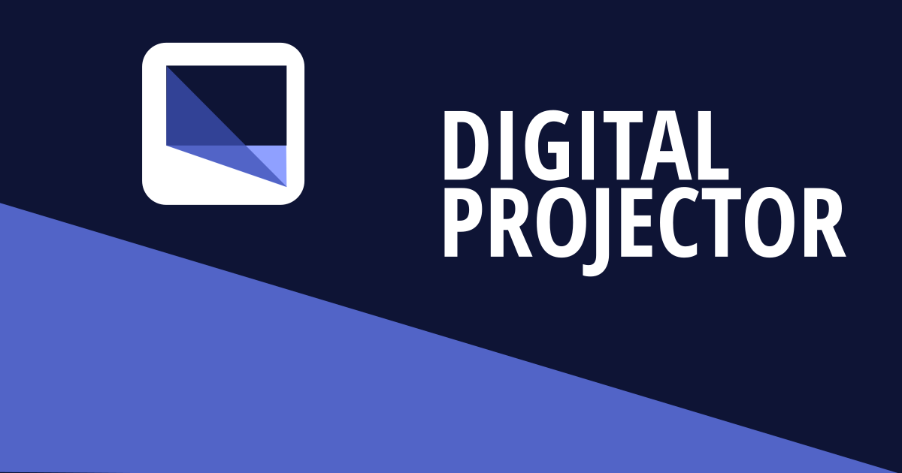
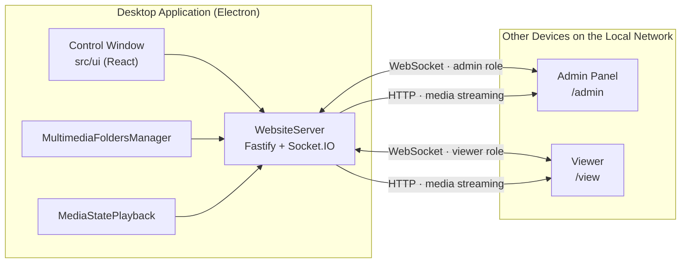

<p align="center">
  
</p>

<h1 align="center">Digital Projector</h1>

<p align="center">
  Convierte un PC con Windows o Linux en un servidor multimedia de red local,<br>
  controlable en tiempo real desde cualquier otro dispositivo.
</p>

<p align="center">
  
  
  
  
  
  
</p>

# Table of Contents

* [What is Digital Projector?](#what-is-digital-projector)
* [How It Works](#how-it-works)
* [Features](#features)
* [Screenshots](#screenshots)
* [Architecture](#architecture)
* [Technologies](#technologies)
* [Getting Started](#getting-started)
* [Available Scripts](#available-scripts)
* [Project Structure](#project-structure)
* [Testing](#testing)
* [Contributing](#contributing)
* [License](#license)

## What is Digital Projector?

**Digital Projector** is an Electron-based desktop application that plays locally stored images, videos, and audio while exposing a web-based control panel accessible from any device connected to the same local network (phone, tablet, or another computer)—without relying on the internet or external infrastructure.

Internally, the application starts an HTTP server (Fastify) alongside a WebSocket channel (Socket.IO) that serves the administration panel and keeps the playback state—current file, playback position, pause status, volume, and visual settings—synchronized across all connected clients in real time. It is designed for digital signage, remotely controlling a display or projector from a mobile device, or managing presentations over a local area network.

## How It Works

1. When the application starts, Electron launches the embedded server (`WebsiteServer`) using Fastify + Socket.IO and automatically detects the machine's local IP address.
2. The desktop control window displays both a QR code and a URL for pairing another device. The QR code points directly to `http://<local-ip>:<port>/admin`.
3. The second device opens the administration panel (served statically by the same Fastify server) and authenticates with the WebSocket using the `admin` role.
4. The administrator selects a local folder. `MultimediaFoldersManager` scans and indexes its contents, assigning stable identifiers to every file to support ordered navigation ("next" / "previous").
5. When media playback starts, `MediaStatePlayback` stores the complete playback state (current file, playback position, pause status, brightness, contrast, saturation, blur, opacity, and volume), while `MediaSyncService` broadcasts it via WebSocket to every client authenticated as a `viewer`.
6. Viewer clients play the content in sync, streaming files over HTTP with automatic MIME type detection while applying visual settings without reloading the page.

## Features

* **Real-time playback synchronization** between the administration panel and connected viewers using WebSockets (Socket.IO).
* **Complete remote control**, including play/pause, previous/next media, playback position, and volume.
* **Live visual adjustments**, including brightness, contrast, saturation, blur, and opacity applied instantly on viewers.
* **Streaming of local media files** (images, videos, and audio) directly from disk with automatic MIME type detection.
* **Media library management**, including folder selection, scanning, indexing, and ordered navigation.
* **Role-based access** using `admin` and `viewer` roles authenticated during the Socket.IO handshake.
* **Fast device pairing** via QR code or direct URL with automatic local IP detection.
* **Cross-platform support**, with native installers for Windows (NSIS) and Linux (AppImage) built using `electron-builder`.
* **Continuous integration and quality assurance**, featuring unit tests with Vitest, end-to-end tests with Playwright, and automated build + test workflows in GitHub Actions for every push to `main`.
* **Open source** under the MIT License.

## Screenshots

## Architecture

The project is organized as an **npm workspaces monorepo** composed of three main components working together:



* **`src/electron`** — Electron main process containing the embedded server (`WebsiteServer`), role-based socket authentication, media folder management, and playback state management.
* **`src/ui`** — Desktop control window built with React and `react-router-dom`.
* **`packages/website`** — React web application served by `WebsiteServer`, containing the `/admin` control panel and the `/view` viewer accessed by other devices on the network.
* **`packages/shared`** — Shared TypeScript types and constants used by both the Electron backend and the web frontend through the `@digital-projector/shared` workspace package.

## Technologies

| Category                 | Stack                                                   |
| ------------------------ | ------------------------------------------------------- |
| Desktop Runtime          | Electron                                                |
| Frontend                 | React 19, React Router, Mantine, Vite, TypeScript       |
| Embedded Backend         | Fastify, Socket.IO                                      |
| Packaging / Distribution | electron-builder (NSIS for Windows, AppImage for Linux) |
| Testing                  | Vitest (unit/integration), Playwright (end-to-end)      |
| Code Quality             | ESLint, TypeScript (strict mode)                        |
| CI/CD                    | GitHub Actions                                          |

## Getting Started

### Download

Windows (`.exe`) and Linux (`.AppImage`) installers are available in the repository's **Releases** section.

### Development Environment

#### Requirements

* Node.js 22+
* npm 10+ (included with Node.js 22)
* Git

#### Clone the Repository

```bash
git clone https://github.com/Bastiasa/digital-projector.git
cd digital-projector
```

#### Install Dependencies

The project uses npm workspaces, so installing dependencies from the root also installs `packages/shared` and `packages/website`.

```bash
npm install
```

#### Development Mode

Builds the internal packages, starts Vite, and launches the Electron application with hot reloading.

```bash
npm run dev
```

#### Build

```bash
npm run build
```

#### Create Installers

```bash
npm run dist:win     # Windows NSIS installer
npm run dist:linux   # Linux AppImage
```

## Available Scripts

| Script                            | Description                                                                |
| --------------------------------- | -------------------------------------------------------------------------- |
| `npm run dev`                     | Builds and runs the complete application in development mode               |
| `npm run build`                   | Builds the shared packages, UI, Electron main process, and preload scripts |
| `npm run dist:win` / `dist:linux` | Generates installers for Windows and Linux                                 |
| `npm run lint`                    | Runs ESLint across the project                                             |
| `npm test`                        | Executes the Vitest test suite                                             |
| `npm run preview`                 | Serves a production build of the UI for preview                            |

## Project Structure

```text
digital-projector/
├── src/
│   ├── electron/      # Main process: server, IPC bridge, media, and playback state
│   └── ui/            # Desktop control UI (React + React Router)
├── packages/
│   ├── shared/        # Shared types and constants (@digital-projector/shared)
│   └── website/       # Admin panel (/admin) and viewer (/view) served over the LAN
├── tests/             # Unit and integration tests (Vitest)
├── icons/             # Application icons
└── electron-builder.json
```

* **`src/electron`** — Core application logic, including the embedded server, role-based socket authentication, media folder management (`MultimediaFoldersManager`), and playback state management (`MediaStatePlayback`).
* **`src/ui`** — Desktop control interface.
* **`packages/shared`** — Shared types and constants (such as `PlaybackData`) used by both the backend and frontend.
* **`packages/website`** — Web frontend deployed alongside the server, providing the administration panel and viewer used by other devices.

## Testing

```bash
npm test
```

Unit and integration tests (Vitest) primarily cover media library management. End-to-end tests are implemented with Playwright.

The CI workflow (`.github/workflows/ci.yaml`) installs dependencies, builds the project, runs the test suite on every push to `main`, and validates production builds for both Linux and Windows.

## Contributing

Contributions are welcome.

1. Fork the repository.
2. Create a descriptive branch:

   ```bash
   git checkout -b feature/your-feature-name
   ```
3. Make your changes while following the project's coding standards:

   ```bash
   npm run lint
   ```
4. Ensure all tests pass:

   ```bash
   npm test
   ```
5. Open a Pull Request describing your changes and their motivation.

## License

Distributed under the MIT License. See [LICENSE](LICENSE) for more information.

© 2026 Luis Bastidas.
